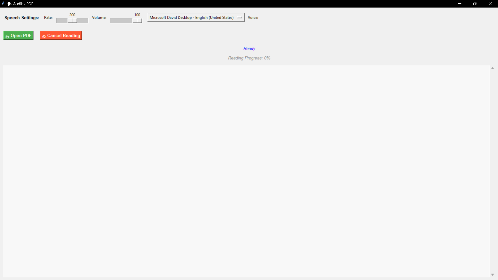

# 🧪 AudiblePDF


  #### This app allows users to load a PDF file and hear its contents read aloud using customizable voice settings and a user-friendly GUI built with Tkinter.




## 📌 Core Features
  #### ✅ PDF-to-Speech using pyttsx3
  #### ✅ Multithreaded reading with cancellation support
  #### ✅ Custom voice selection, rate, and volume controls
  #### ✅ Progress tracking during reading
  #### ✅ Tkinter GUI with scrollable PDF text display
  ---

  ## 🔧 Dependencies

#### Install the required Python libraries:
```
      pip install pyttsx3
      pip install pdfplumbe
      pip install Tkinterer
```
# 🚀 How to Use
#### Open your Python IDE (IDLE, Vs-code, etc.)

#### Copy and run the `pdf_reader.py` script

Use the GUI to:

 - `📂 Open a PDF file`
 - `Adjust reading speed, volume, and voice`
 - `🚫 Cancel reading at any time`

# 🛠 Development Notes
- Uses threading to keep the UI responsive during long reads
- `pdfplumber` ensures reliable text extraction from PDFs
- `stop_event` enables clean shutdown of speech threads
- Voice options depend on system-installed `TTS voices`


> ⚠️ **If any error occurs, don't forget to _submit an issue_ with the error message!**
